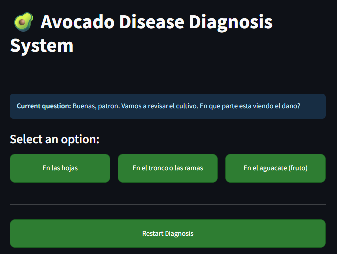
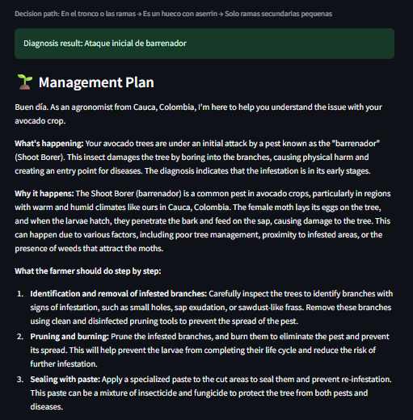
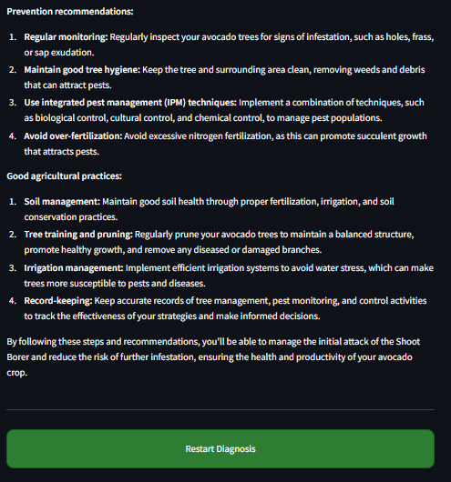

# 🥑 Cauca Avocado Diagnosis Assistant

Sistema inteligente basado en grafos e inteligencia artificial para apoyar el diagnóstico de enfermedades y problemas en cultivos de aguacate.

El sistema guía al agricultor mediante preguntas dinámicas y genera recomendaciones utilizando IA.

---

## 🚀 Características

- Diagnóstico basado en grafos de decisión
- Interfaz interactiva con Streamlit
- Generación de recomendaciones usando IA
- Recorrido dinámico según síntomas observados
- Explicaciones claras y prácticas para agricultores
- Enfoque aplicado al contexto agrícola del Cauca

---

## ⚠️ Aviso Importante

Este proyecto fue desarrollado con fines educativos y experimentales.

Las recomendaciones generadas no reemplazan la asesoría profesional de un ingeniero agrónomo.

---

## 🛠️ Tecnologías Utilizadas

- Python
- Streamlit
- Groq API
- JSON
- Grafos de decisión
- Prompt Engineering

---

## 📸 Capturas

### Pantalla principal



### Sistema de diagnóstico



### Recomendaciones generadas por IA



---

## ▶️ Instalación

### 1. Clonar el repositorio

```bash
git clone https://github.com/KevinCastillo019/ai-avocado-diagnosis.git
```

### 2. Entrar al directorio

```bash
cd ai-avocado-diagnosis
```

### 3. Crear entorno virtual (opcional pero recomendado)

```bash
python -m venv venv
```

### 4. Activar entorno virtual

#### Windows

```bash
venv\Scripts\activate
```

#### Linux / Mac

```bash
source venv/bin/activate
```

### 5. Instalar dependencias

```bash
pip install -r requirements.txt
```

### 6. Configurar variables de entorno

Crear archivo `.env`

```env
GROQ_API_KEY=tu_api_key
```

### 7. Ejecutar la aplicación

```bash
streamlit run app.py
```

---

## 🌱 ¿Cómo funciona?

El sistema utiliza un grafo de decisiones para recorrer síntomas observados en el cultivo.

Dependiendo de las respuestas del usuario:

1. El sistema navega entre nodos del grafo
2. Identifica un posible diagnóstico
3. La IA genera recomendaciones específicas
4. Se muestran tratamientos y medidas preventivas

El archivo `data.json` define el árbol de decisiones y `graph_utils.py` lo normaliza a un esquema interno único para la app web y la versión por consola.

---

## 🧠 Arquitectura General

```text
Usuario
   ↓
Sistema de preguntas
   ↓
Grafo de decisiones
   ↓
Diagnóstico identificado
   ↓
Modelo LLM (Groq)
   ↓
Recomendaciones agrícolas
```

---

## 🎯 Objetivos del Proyecto

- Aplicar inteligencia artificial en agricultura
- Implementar estructuras de grafos
- Desarrollar interfaces interactivas
- Integrar modelos LLM en aplicaciones reales
- Crear soluciones tecnológicas aplicadas al campo

---

## 📂 Estructura del Proyecto

```text
project/
│
├── app.py
├── ai_service.py
├── graph_utils.py
├── prompt.py
├── data.json
├── requirements.txt
├── README.md
├── .gitignore
│
├── screenshots/
│   ├── home.png
│   ├── diagnosis.png
│   └── recommendations.png
│
└── static/
```

---

## 🔮 Mejoras Futuras

- Historial de diagnósticos
- Exportación de reportes
- Integración con bases de datos
- Sistema multi-cultivo
- Soporte para imágenes
- Dashboard de estadísticas
- Deploy en la nube

---

## 📌 Estado del Proyecto

En desarrollo 🚧

---

## 👨‍💻 Autor

Kevin Castillo

💻 Software Developer  
🚀 Python | AI | Web Development  
📍 Popayán, Colombia

---

## ⭐ Si te gustó el proyecto

Puedes darle una estrella al repositorio para apoyar el proyecto.
